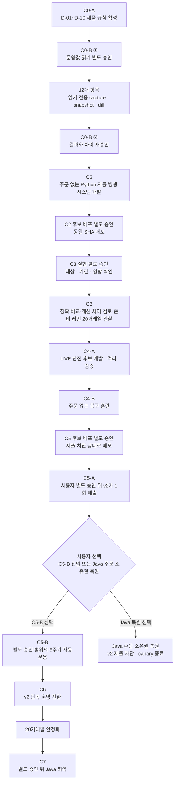

# Python v2 구현 런웨이

기준일: 2026-08-09 KST<br>
현재 단계: `C0-B 읽기 전용 수집 승인 · 12개 정제 결과 재승인 대기`<br>
C2 개발 상태: `미시작`

이 문서는 승인 뒤 무엇을 어떤 순서로 개발하고, 사용자가 화면에서 무엇을 확인하며,
어떤 증거가 있어야 다음 단계로 넘어가는지를 한곳에 모은 실행 계획이다. 상세 제품 규칙은
[`C0_DECISIONS.md`](C0_DECISIONS.md), 기능 계약은
[`FUNCTIONAL_SPEC.md`](FUNCTIONAL_SPEC.md), 화면 계약은
[`SCREEN_SPEC.md`](SCREEN_SPEC.md)를 정본으로 사용한다.

이 문서 작성과 현재 C0-B 수집 승인은 C2 개발 착수를 뜻하지 않는다. 현재 허용 범위는
승인된 12개 대상의 GitHub Actions PROD SSH shell 조회·DB SELECT, 필수 정제,
`docs/v2-cutover/evidence/c0b/` 저장이다. 원문 저장·변경 명령·주문·서비스 중단은 허용되지
않으며, C2 소스 변경은 정제된 운영값·차이·checksum을 사용자가 C0-B에서 재승인한 뒤에만
시작한다.
전체 승인 순서는 `C0-A 확정 → C0-B 수집 별도 승인 → 정제된 운영값 수집·차이 확인 →
C0-B 결과 재승인 → C2`이며, 현재는 두 번째 단계까지 기록됐다.

## 1. 전체 경로



코드 완료와 시스템 대체 완료는 다르다. 현재 제안 계약을 그대로 승인하면
`C2 개발 → C2 후보 배포 승인 → C3 대상·기간·영향 실행 승인 → C3 20거래일 → C4-A
LIVE 안전 후보 개발·격리 검증 → C4-B 복구 훈련 → C5 후보 배포 승인 → C5-A v2 단건
제출·대조 → C5-B 진입 또는 Java 주문 소유권 복원 선택`이 먼저 남는다. C5-B를 선택한
경우에만 `C5-B 범위·기간 승인과 5주기 자동운용 → C6 전환 → 20거래일 안정화 → C7
Java 퇴역 승인`으로 이어진다. 세 개의 C3 관찰 레인은 같은 20거래일 동안 병렬로 진행할
수 있지만, C3와 C6 안정화 기간은 서로 대신하지 않는다.

## 2. 현재 코드에서 재사용할 것과 새로 만들 것

| 구분 | 현재 근거 | 정확한 판정 |
| --- | --- | --- |
| QQQM 신호와 QQQM/QLD/TQQQ 고정 종목군 | `v2/backend/src/wallant/domain/defaults.py`, `domain/strategy.py` | 재사용 가능 |
| 낙폭·회복·기준 비중·MA/VIX 후보 수식 | `domain/evaluator.py` | 수식 후보는 있으나 16:15와 다음 09:45가 분리되지 않음 |
| 5% 판단·매도 후 매수 순서 | `domain/execution.py` | 방향·순서 기반은 있으나 Java 수량 동등성 미증명 |
| 연구·수동 paper | `research/`, `api/research.py` | 자동 shadow가 아닌 수동 연구 기능 |
| run/state/intent/audit 기본 테이블 | `persistence/models.py` | 확장 기반만 있음. shadow 실행 유일성·불변 시도 없음 |
| 주문 차단 | `config.py`, `broker/disabled.py` | 현재 안전 기본값. 운영 원격값은 재확인 전 |
| Python 자동 실행기 | 없음 | 미구현 |
| 운영 읽기 어댑터·Java 비교기 | 없음 | 미구현 |
| shadow/QA/cutover 조회 API와 화면 | 없음 | 미구현 |
| LIVE 자동 제출·접수·체결·대조 | 없음 | C3 통과 뒤 C4-A에서 개발·격리 검증하고, 별도 후보 배포·C5-A 제출 승인을 거치는 대상 |

현재 Python 테스트의 통과는 위 재사용 기반을 증명할 뿐 자동운영을 증명하지 않는다. 특히
전략 정의의 `schedule="EOD"`는 실행되지 않는 메타데이터이며, 현재 화면 QA 26개는 6개
화면의 탐색·안전 잠금·반응형 계약 범위다.

## 3. C2 개발 묶음

아래 여섯 묶음은 C0-B 결과 재승인 뒤 순서대로 진행한다. 각 묶음은 코드, 단위·통합
테스트, 화면에서 확인할 읽기 결과, 증적을 함께 끝내야 완료다.

### C2-1. 하루 두 판단을 정확히 분리

이번에 좋아지는 것:

- 미국 거래일 16:15 ET에는 QQQM의 EOD 상태와 QQQM/QLD/TQQQ 기준 비중만 계산한다.
- 다음 거래일 09:45 ET에는 당시 계좌·호가·VIX·MA200으로 보호 규칙, 5% 판단,
  `SHADOW` 주문 의도를 계산한다.
- bid/ask, 반올림, 수수료·매도대금 보수값을 승인된 Java 수량 규칙과 맞춘다.

주요 코드 대상:

- `domain/evaluator.py`, `domain/execution.py`, `domain/strategy.py`
- 신규 `shadow` application service와 두 단계 입력·출력 모델

사용자가 화면에서 확인할 것:

- EOD 기준 비중과 다음 날 최종 비중이 섞이지 않는지
- 각 종목의 매수·매도 방향과 차단 이유가 쉬운 문장으로 보이는지

통과 증적:

- EOD에서 VIX·MA200을 사용하지 않는 회귀 테스트
- 09:45가 최신 EOD와 직전 EOD를 구분하는 테스트
- 공통 Java/Python 입력에서 phase·비중·방향·정확한 수량 비교

절대 하지 않는 것: 스케줄 시작, 운영 데이터 접근, 브로커 제출 호출.

### C2-2. 주문 기능과 분리된 읽기 입력 구축

이번에 좋아지는 것:

- 시장 캘린더, 가격, VIX·MA200, 계좌, Java 결과를 각각 읽기 전용 포트로 분리한다.
- 출처·계약 버전·시장일·가격 의미·통화·관측/가용 시각·확정 여부·checksum을 함께
  정규화한다.
- 필수값이 빠지거나 늦거나 서로 다른 시장일이면 조용히 계산하지 않고 차단한다.

주요 코드 대상:

- 신규 `ports/`, `adapters/calendar/`, `adapters/kis/`, `adapters/indicator/`,
  `adapters/legacy/`
- 조회와 `submit`이 섞인 현재 `broker/base.py`의 타입 경계 분리

사용자가 화면에서 확인할 것:

- 어떤 입력을 언제 읽었는지
- 왜 오래됐거나 부족하다고 차단됐는지

통과 증적:

- 60초 신선도 경계, MA 199/200개, 휴장·조기 종료, 혼합 시장일·통화 차단 테스트
- shadow 의존성 그래프에서 제출 포트 참조 0건
- 비공식 연구 공급자가 운영 준비 레인에 들어가지 못하는 테스트

절대 하지 않는 것: 실제 자격증명 등록·교체, 공유 환경 조회, 제출 포트 주입.

### C2-3. 중복 없이 자동 실행하고 불변으로 저장

이번에 좋아지는 것:

- 16:15와 09:45 due job, 미국 거래소 캘린더, DST, 재시도, 마감, 재기동 보충을
  내구성 worker로 실행한다.
- logical run과 checksum별 immutable attempt를 분리하고 기존 결과를 덮어쓰지 않는다.
- 동시 실행, worker crash, lease 만료 뒤에도 한 시장일에 중복 의도가 생기지 않는다.

주요 코드 대상:

- 신규 `scheduler/`, `workers/shadow.py`, shadow repository
- 신규 Alembic migration과 shadow subscription/run/attempt/snapshot 모델
- worker 전용 service unit 후보

사용자가 화면에서 확인할 것:

- 오늘 16:15와 다음 09:45가 각각 언제 한 번 처리됐는지
- 다음 시도, 마감, 마지막 성공, 차단·실패 원인

통과 증적:

- fake clock의 DST·휴장·조기 종료·+5/+15/+30분·deadline 테스트
- MySQL logical run unique, 같은 checksum 재실행 반환, 다른 checksum 불변 시도 보존
- crash/lease recovery와 과거 09:45 현재값 재구성 금지 테스트

절대 하지 않는 것: 공유 서버 스케줄 시작, Java 서비스 변경, 주문 제출.

### C2-4. Java와 두 방식으로 비교

이번에 좋아지는 것:

- 같은 normalized input을 Java/Python에 넣는 알고리즘 비교와 각자 운영 입력으로 계산한
  운영 결과 비교를 분리한다.
- Java EOD와 09:45 preview 결과는 읽기 전용 exporter로만 받는다.
- 입력 차이, 수식 차이, 실행 차이, 표시 차이, 안전 차단, Java 결과 없음이 서로 다른
  상태로 남는다.

주요 코드 대상:

- 신규 `domain/comparison.py`, comparator service, `LegacyResultPort`
- Java offline harness/export schema와 diff persistence

사용자가 화면에서 확인할 것:

- 무엇이 다른지와 그 차이가 입력 때문인지 계산 때문인지
- 두 원문의 checksum과 승인 허용 범위

통과 증적:

- 모든 diff 분류와 허용값 경계 테스트
- 독립 checksum을 억지로 같다고 요구하지 않는 운영 비교 테스트
- Java exporter가 DB·설정·스케줄·주문 상태를 변경하거나 주문 함수를 참조하지 않는 검사

절대 하지 않는 것: Java 결과 수정, 차이 자동 수용, 승인 전 허용 오차 변경.

### C2-5. 화면에서 오늘과 최근 20일을 설명

이번에 좋아지는 것:

- `shadow summary/runs/detail`, `QA releases/detail/manifest`, `cutover status`의 GET-only
  API를 구현한다.
- S-01 오늘의 운영, S-04 자동 병행 비교, S-08 검증 증적, S-09 전환 센터를 실제 React
  화면으로 연결한다.
- S-10 운영값 재확인은 정제된 C0-B artifact를 읽는 방식으로 공급하고 원문은 노출하지
  않는다.

주요 코드 대상:

- 신규 `api/shadow.py`, `api/qa_releases.py`, `api/cutover.py`
- `v2/frontend/src/api.ts`, `App.tsx`, 화면별 React 구성요소

사용자가 화면에서 확인할 것:

- 오늘 일정·마지막 성공·데이터 상태·Java 차이
- 최근 20거래일의 정확 비교·개선 차이 검토·준비 레인, 실행 상세, QA 증적, 다음 승인

통과 증적:

- exact schema, stable sort, cursor, filter, stale, masking 테스트
- 모든 GET의 DB DML·감사 추가·파일 변경 0건 테스트
- 1440px·360px 키보드·반응형 화면과 실패/빈 상태 증적

절대 하지 않는 것: 생성·승인·재개·주문 API 추가, C0-B 원문 표시.

### C2-6. 전체 흐름을 주문 없이 연결

이번에 좋아지는 것:

- runner → 읽기 어댑터 → 상태/의도 저장 → Java 비교 → GET API → 화면을 하나의
  격리된 경로로 검증한다.
- 실제 제출 능력이 없는 harness에서 정상·누락·차이·재기동 시나리오를 반복한다.
- 후보 SHA마다 화면 QA와 증적 무결성을 같은 실행에서 만든다.

사용자가 화면에서 확인할 것:

- “오늘 자동으로 어디까지 진행됐고 왜 멈췄는지”를 한 화면에서 설명할 수 있는지
- QQQM/QLD/TQQQ 의도, Java 차이, 주문 제출 0건이 함께 보이는지

통과 증적:

- `QA-SHD-001/002`, `QA-PAR-001` 전체 통합
- 실제 submit spy 0, Java 영향 0, 중복 0, 외부 상태 변경 0
- 단위·MySQL·프런트엔드·Playwright·증적 verifier를 같은 SHA에서 통과

절대 하지 않는 것: 후보 배포, 공유 DB 기록, 공유 스케줄 시작, LIVE adapter 설치.

## 4. C2 묶음별 완료 판정

| 묶음 | 코드 완료 근거 | 화면 완료 근거 | 안전 근거 | 다음 게이트 |
| --- | --- | --- | --- | --- |
| C2-1 전략 분리 | 두 단계·수량 테스트 | EOD/09:45 설명 fixture | submit import 0 | C2-2 |
| C2-2 입력 | 포트·정규화·완전성 테스트 | provenance·차단 fixture | read-only 타입 경계 | C2-3 |
| C2-3 자동 실행·저장 | scheduler·MySQL·crash 테스트 | 일정·시도·마감 fixture | 중복 의도 0 | C2-4 |
| C2-4 비교 | Java exporter·diff 테스트 | 필드별 차이 fixture | Java 변경 0 | C2-5 |
| C2-5 API·화면 | GET schema·React 테스트 | desktop/mobile 증적 | GET DML 0 | C2-6 |
| C2-6 종합 | 전체 CI·격리 통합 | no-order QA bundle | submit 0·Java 영향 0 | 후보 배포 별도 승인 |

각 행의 세 근거 중 하나라도 없으면 해당 묶음은 `부분`이다. 다음 묶음의 기반 작업을
병렬로 준비할 수는 있지만, 누락된 근거를 완료로 올려 적지 않는다.

## 5. C4-A LIVE 안전 후보 개발

C3의 세 레인이 20거래일을 통과한 뒤, C5-A에서 실제 1건을 내기 전에 아래 후보를 먼저
개발하고 실제 증권사와 연결되지 않은 broker simulator에서 인수한다. 이 단계는 D-10의
미래 자동운용 계약을 구현하는 작업이며 실제 주문 승인이나 공유 환경 배포 승인이 아니다.

개발 범위:

- KIS 제출 adapter와 조회 adapter의 타입·의존성 분리
- Java/v2 단일 주문 소유권 잠금과 서버 측 승인 gate
- 제출 직전 journal → 전송 → 접수 ID → 미체결·부분체결 → 체결·현금·잔고·상태 대조
- 접수 불명 시 자동 재전송 금지, 신규 제출 freeze, 영향 계좌 보호 정지
- 매도 우선·매수 후순위 직렬 처리와 다음 주문 진입 조건
- 감사·알림과 재기동 뒤 reconciliation

격리 통과 증적:

- 제출 직전부터 접수 저장·부분체결·체결 반영 뒤까지 crash matrix
- 같은 idempotency key의 제출 1회, 접수 불명 자동 재전송 0
- 단일 주문 소유권, 미확정 주문, freeze·재개 승인 경계
- simulator의 거부·timeout·부분체결·중복 응답 시나리오

절대 하지 않는 것: 실제 자격증명 사용, 실제 증권사 endpoint 호출, 공유 환경 설치·배포,
Java 주문 소유권 변경, 실제 주문.

C4-A와 C4-B가 통과하면 정확한 SHA·배포 대상·DB 영향·Java PID 보존·실행 차단값·롤백값을
보여 주고 **C5 후보 배포를 별도로 승인**받는다. 제출 차단 상태의 동일 SHA 배포가 확인된
뒤에도 C5-A의 계좌·종목·수량·최대 금액을 다시 보여 주고 **실제 단건 제출을 별도 승인**
받는다. 사용자가 브로커 화면에서 직접 낸 주문은 v2 제출 adapter의 인수 증적으로 세지
않는다.

## 6. 화면 QA 레인

### 로컬에서 자동으로 할 것

- 현재 6개 화면의 탐색·안전 잠금·반응형 26개 회귀를 유지한다.
- 전략 생성, 대표 평가, CSV 오류, 정지 계좌, 감사 표시를 실제 backend로 보내지 않는
  local-fulfill 기능 suite로 추가한다.
- shadow 화면은 C2 runtime fixture와 GET-only API fixture로 desktop/mobile을 검증한다.
- 기능 suite와 읽기 전용 배포 suite는 서로 다른 QA ID와 manifest로 유지한다.

현재 26/26에 포함되지 않은 기능 QA:

- `QA-STR-001`
- `QA-RES-001~003`
- `QA-ERR-001`
- `QA-ACCNT-001`
- `QA-AUD-001`
- `QA-PAP-001`: paper session 시작·날짜별 step·완료 화면과 브로커 호출 0건.

### 승인된 후보 배포마다 반복할 것

```text
후보 SHA·대상·DB 영향·Java PID 보존·롤백값 확인
→ 사용자 후보 배포 승인
→ 동일 SHA 배포
→ 사용자가 브라우저에서 직접 로그인
→ exact health와 후보 snapshot GET
→ GET-only 인증 화면 QA
→ 마스킹된 증적 검증
```

현재 6화면 계약의 성공 묶음은 PNG 12개, 정제 관찰 JSON 2개, manifest 1개의 정확한
15파일이다. 미래 S-04/S-08/S-09를 추가한 확대 묶음은 기존 계약을 조용히 바꾸지 않고 새
QA ID와 schema version으로 정의한다.

### 사용자에게 남길 위험 작업

다음 작업은 화면에서 안내·입력·기대 결과·중단 조건·되돌리기·마스킹 증적을 보여 주되,
마지막 실행은 사용자가 직접 한다.

- 실제 KIS 자격증명과 계좌 접근
- 전략 LIVE 승인·계좌 할당·재개
- C5-A의 정확한 의도를 확인한 뒤 v2 단건 제출 별도 승인
- Java 주문 경로 중단
- DNS·Tunnel·Access 정책 변경
- 공유 환경 롤백 확정
- C5-B 5주기 활성화
- C6 전체 전환과 C7 Java 퇴역

## 7. C3 이후 달력과 승인

| 단계 | 실행 내용 | 최소 관찰 단위 | 자동으로 이어지나 |
| --- | --- | --- | --- |
| C3 | 알고리즘 정확 비교·승인된 데이터 개선 차이 검토·운영 준비 세 레인 | 연속 미국 거래일 20일 | 아니요. 공유 환경 실행과 영향 있는 개선 차이 사용자 확인은 별도 승인 |
| C4-A | LIVE 안전 후보 개발·broker simulator 격리 인수 | crash matrix 전부 | 아니요. 실제 증권사 연결·자격증명·주문 없음 |
| C4-B | 복구·재기동·롤백 훈련 | 승인된 시나리오 전부 | 아니요. 실제 주문 없음 |
| C5 후보 | 제출 차단 상태의 동일 SHA 배포 | health·차단값·롤백 확인 | 아니요. 후보 배포와 C5-A 제출은 서로 다른 승인 |
| C5-A | 사용자가 의도를 확인·별도 승인한 v2 단건 제출 | v2 실제 제출 1건 | 아니요. 브로커 수동 주문은 인수 증거가 아니며, 사용자가 C5-B 또는 Java 복원을 선택 |
| C5-B | 제한 범위 자동운용 | 연속 5주기 | 아니요. 계좌·금액·기간·종료일 별도 승인 |
| C6 | v2 단일 주문 소유권 | 전환 뒤 연속 미국 거래일 20일 안정화 | 아니요. Java 퇴역은 별도 승인 |
| C7 | Java 퇴역 | 안정화 근거와 복구 계획 | 사용자 최종 승인 전 금지 |

즉 “개발에 며칠”과 “안전하게 대체되기까지 달력상 얼마나”는 별개의 질문이다. 현재
계약은 코드가 완성된 뒤에도 두 번의 20거래일 구간과 그 사이의 5주기 canary를 요구한다.

## 8. 사용자가 검토할 순서

1. [C0-A 기록](C0_DECISIONS.md#c0-a-제품-결정-기록)의 D-01~D-10 `조건부 승인`을 확인한다.
2. [C0-B 기록](C0_DECISIONS.md#c0-b-운영-기준선-재확인-기록)에 정확한 12개 대상·접근·권한·정제·저장·보존 범위가
   `수집 승인`으로 기록됐는지 확인한다.
3. 승인된 읽기 전용 경로로만 12개 항목을 수집·정제하고 원문은 저장하지 않는다.
4. 정제된 12개 값·C0-A 차이·checksum을 사용자에게 보여 주고 C0-B 결과 재승인을 받는다.
5. C0-B 결과 재승인이 기록된 뒤에만 C2 개발에 착수한다.

## 9. 최종 완료 정의

사용자의 전체 목표는 아래가 모두 증명돼야 완료다.

- Python v2가 승인된 QQQM 기반 QQQM/QLD/TQQQ 전략을 정해진 시각에 자동 실행한다.
- 단일 주문 소유권 아래 제출·접수·미체결/부분체결·체결·현금·잔고·상태 대조가 자동으로
  이어지고, 접수 불명 시 재전송하지 않는다.
- 인증 화면에서 운영 상태·전략·데이터·차이·QA·전환 상태를 확인할 수 있다.
- 자동 QA는 실제 주문 0건으로 끝나며, 위험 시나리오는 사용자가 직접 실행할 수 있는
  안내와 증적 입력을 제공한다.
- C3, C4, C5-A, C5-B, C6 안정화, C7 승인까지 현재 계약대로 통과한다.
- Java 중단·DNS/트래픽 전환·실주문·롤백 확정은 각각 사용자 승인 기록이 있다.
